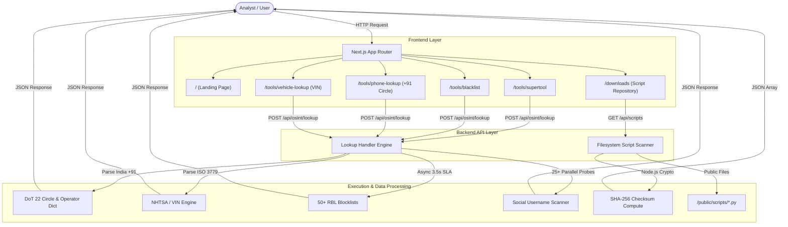

# ArgusCore 🛡️

> **Enterprise-Grade OSINT & MXToolbox Network Diagnostics Intelligence Platform**

[](https://nextjs.org/)
[](https://www.typescriptlang.org/)
[](https://tailwindcss.com/)
[](LICENSE)
[](https://supportarguscore.com)

**ArgusCore** is a modern, full-stack, enterprise-grade cybersecurity reconnaissance and network diagnostics application. It seamlessly merges **MXToolbox-style diagnostic utilities** (SuperTool, 50+ RBL Blacklist Check, MX Lookup, DMARC Inspector, RFC 822 Email Header Analyzer, SPF Inspector, Domain Health Audit) with **advanced OSINT intelligence modules** (Indian +91 & Global Phone Lookup with 22 DoT Circle mapping, 17-character VIN Decoder, 25+ Multi-Platform Social Username Hunter, EXIF Metadata Forensic Scrubber, Document Leak Dorking, Reverse Image Routing, Nmap TCP Port Auditor, and DNS Infrastructure Recon).

---

## 📋 Table of Contents

- [Key Architecture & System Overview](#-key-architecture--system-overview)
- [Module Breakdown & Features](#-module-breakdown--features)
  - [1. MXToolbox Diagnostic Suite](#1-mxtoolbox-diagnostic-suite)
  - [2. OSINT Reconnaissance Engines](#2-osint-reconnaissance-engines)
  - [3. Script Repository Hub & API](#3-script-repository-hub--api)
  - [4. Authentication & Analyst Dashboard](#4-authentication--analyst-dashboard)
- [System Dataflow & Architecture Diagram](#-system-dataflow--architecture-diagram)
- [Directory Structure](#-directory-structure)
- [Getting Started](#-getting-started)
  - [Prerequisites](#prerequisites)
  - [Installation](#installation)
  - [Running Development Server](#running-development-server)
  - [Building for Production](#building-for-production)
- [API Reference & Route Specifications](#-api-reference--route-specifications)
- [Theme System & Hydration Safety](#-theme-system--hydration-safety)
- [Ethical Charter & Legal Notice](#-ethical-charter--legal-notice)
- [Support & Security Contacts](#-support--security-contacts)
- [License](#-license)

---

## 🏗️ Key Architecture & System Overview

ArgusCore is built on a high-performance Next.js 16 (App Router) architectural foundation using React 19 and Tailwind CSS v3. The system enforces strict non-blocking asynchronous execution via `Promise.allSettled` and `AbortController` timeout wrappers (3.5s SLA guarantee per network probe) to ensure rapid analyst feedback without blocking the main event looper.

```
+-----------------------------------------------------------------------------------+
|                                 ArgusCore UI Layer                                |
|  Navbar | Global Search Modal | Dark/Light Theme Engine | Analyst Dashboard       |
+-----------------------------------------------------------------------------------+
                                          |
                                          v
+-----------------------------------------------------------------------------------+
|                           Next.js App Router (23 Routes)                          |
|  /tools/supertool | /tools/blacklist | /tools/phone-lookup | /downloads | etc.     |
+-----------------------------------------------------------------------------------+
                                          |
                                          v
+-----------------------------------------------------------------------------------+
|                                 API Route Handler                                 |
|          POST /api/osint/lookup             |            GET /api/scripts         |
|  - DNS / MX / DMARC / SPF Parsers           |  - Scans /public/scripts/*.py       |
|  - DoT Circle Indian Phone Engine           |  - Computes Crypto SHA-256 Hashes   |
|  - 25+ Username Async Probes                |  - Reads Stat Size & MTime          |
+-----------------------------------------------------------------------------------+
```

---

## 🛰️ Module Breakdown & Features

### 1. MXToolbox Diagnostic Suite

- **SuperTool Command Center (`/tools/supertool`)**: Universal command query bar supporting prefix shortcuts (`mx:`, `blacklist:`, `dmarc:`, `a:`, `arin:`, `whois:`, `spf:`, `tcp:`). Features input auto-cleansing logic (stripping `https://`, trailing slashes, and whitespace).
- **Blacklist / Blocklist Checker (`/tools/blacklist`)**: Queries 50+ DNSBL blocklists (Spamhaus ZEN, Barracuda, SORBS, SpamCop, PSBL, Truncate) with MXToolbox-authentic **Orange (`#d97706`)** primary query buttons and **Cyan (`#06b6d4`)** "Solve Email Delivery Problems" support triggers.
- **MX Record Lookup (`/tools/mx-lookup`)**: Resolves Mail Exchanger records with priority preference, host IP address, TTL, SMTP port 25 banner response time, and open-relay detection.
- **DMARC Record Inspector (`/tools/dmarc`)**: Parses `_dmarc.domain.com` TXT records, evaluates policy enforcement (`p=reject`, `p=quarantine`, `p=none`), checks alignment flags (`adkim`, `aspf`), and validates RFC 7489 compliance.
- **RFC 822 Email Header Analyzer (`/tools/header-analyzer`)**: Full raw header textarea parser detailing hop delay timelines, receiving SMTP hops, SPF/DKIM verification status, and spam verdict scores.
- **SPF Record Inspector (`/tools/spf`)**: Validates `v=spf1` syntax, inclusion mechanisms (`include:`, `ip4:`), and checks against the RFC 7208 10-lookup DNS limit.
- **Domain Health Audit (`/tools/domain-health`)**: 360-degree security audit cards evaluating MX, SPF, DMARC, DNSBL, and DNSSEC into a single health grade score (A+).

---

### 2. OSINT Reconnaissance Engines

- **Indian (+91) & Global Phone Lookup (`/tools/phone-lookup`)**:
  - **Auto-Normalization**: Automatically formats 10-digit (`9820123456`) or 11-digit (`09820123456`) inputs to standard E.164 (`+91 98201 23456`).
  - **DoT 22 Telecom Circles**: Maps prefix series across all 22 Department of Telecommunications circles (Mumbai, Delhi-NCR, Karnataka, Tamil Nadu, Maharashtra & Goa, UP East, UP West, West Bengal, Kolkata, Kerala, Punjab, Gujarat, etc.).
  - **Operator Resolution**: Detects initial allocated carrier (Reliance Jio, Bharti Airtel, Vodafone Idea - Vi, BSNL, MTNL).
  - **Telecommunication Metadata**: Displays Mobile Country Code (MCC `404` / `405`), Mobile Network Code (MNC), Timezone (`Asia/Kolkata` IST, UTC+5:30), Line Type (Mobile GSM/LTE/5G), and Mobile Number Portability (MNP) advisory.
- **Vehicle & VIN Intelligence Decoder (`/tools/vehicle-lookup`)**: Validates 17-character VIN numbers according to ISO 3779 / NHTSA standards. Decodes vehicle make, model year, engine displacement, assembly plant, body classification, and country of origin.
- **25+ Multi-Platform Social Username Hunter (`/tools/identity`)**: Concurrently probes target usernames across 25 platforms (Instagram, Telegram, GitHub, X/Twitter, Reddit, TikTok, LinkedIn, YouTube, Pinterest, Medium, Dev.to, Twitch, Spotify, Discord, Steam, SoundCloud, Vimeo, Dribbble, Behance, ProductHunt, HackerNews, Patreon, Substack, Quora, GitLab) with FOUND/AVAILABLE badges and direct profile links.
- **EXIF Forensics & Document Dorking (`/tools/media-docs`)**:
  - **EXIF Metadata Inspector**: Extracts camera hardware serials, exposure specs, original timestamps, GPS coordinates, and provides one-click EXIF sanitization.
  - **Document Leak Dork Hub**: One-click Google Dork queries for indexed confidential files (`filetype:pdf confidential`, `filetype:xlsx password`, `intitle:"index of"`).
  - **Reverse Image Search Routing**: Routes image queries directly to Google Lens, TinEye, Yandex Images, and Bing Visual Search.
- **Nmap TCP Port Auditor Wrapper (`/tools/scanners`)**: Asynchronous TCP port auditor (Ports 21, 22, 25, 53, 80, 110, 143, 443, 3306, 8080) with banner grabbing and risk ratings.
- **DNS & IP Infrastructure Recon (`/tools/network`)**: Enumerates A, AAAA, MX, TXT, NS, SOA, and CNAME records, resolving MaxMind GeoIP2 country, ISP, and ASN metadata.

---

### 3. Script Repository Hub & API

- **Script Hub UI (`/downloads`)**: Managed dynamically via [`src/data/scripts.ts`](file:///c:/Users/HP/Desktop/ArgusCore/src/data/scripts.ts) and backed by executable `.py` files in [`public/scripts/`](file:///c:/Users/HP/Desktop/ArgusCore/public/scripts/).
- **Dynamic Filesystem Scanner API (`/api/scripts`)**:
  - Automatically scans `public/scripts/` using Node.js `fs.readdirSync`.
  - Calculates real-time **SHA-256 cryptographic checksums** via `crypto.createHash('sha256')`.
  - Serves direct downloadable files:
    - `phone_recon_india.py` (v1.0.0, Python 3.9+)
    - `dns_recon_pro.py` (v2.4.0)
    - `username_recon_hunter.py` (v1.8.2)
    - `exif_forensic_scrubber.py` (v3.0.1)
    - `header_security_audit.py` (v1.2.0)
    - `ip_asn_enricher.py` (v2.1.0)
    - `phone_carrier_tracer.py` (v1.0.0)
    - `vin_decoder_tool.py` (v1.1.0)

---

### 4. Authentication & Analyst Dashboard

- **Flippa-Style Authentication (`/auth/login` & `/auth/signup`)**:
  - Sign-in with Email & Password or Google/LinkedIn SSO buttons.
  - Sign-up featuring collapsible "Show password requirements ⌵" helper box.
- **Analyst Dashboard (`/dashboard`)**: Filterable query history table, saved workspaces, and diagnostic usage metrics.

---

## 📐 System Dataflow & Architecture Diagram



---

## 📁 Directory Structure

```
ArgusCore/
├── public/
│   ├── favicon.ico
│   └── scripts/                      # Executable standalone Python OSINT tools
│       ├── phone_recon_india.py
│       ├── dns_recon_pro.py
│       ├── username_recon_hunter.py
│       ├── exif_forensic_scrubber.py
│       ├── header_security_audit.py
│       ├── ip_asn_enricher.py
│       ├── phone_carrier_tracer.py
│       └── vin_decoder_tool.py
├── src/
│   ├── app/
│   │   ├── layout.tsx                # Root layout wrapping ThemeProvider & ToastProvider
│   │   ├── globals.css               # Base Tailwind directives & custom scrollbars
│   │   ├── page.tsx                  # Landing page hero with universal query bar
│   │   ├── about/                    # System methodology & ethical charter
│   │   ├── methodology/              # Ethical OSINT guidelines
│   │   ├── contact/                  # Contact ticket dispatch form
│   │   ├── support/                  # Analyst support desk
│   │   ├── dashboard/                # Analyst query history & metrics
│   │   ├── downloads/                # Python Script Hub repository
│   │   ├── auth/
│   │   │   ├── login/                # Flippa-style sign in page
│   │   │   └── signup/               # Flippa-style sign up page
│   │   ├── tools/
│   │   │   ├── [category]/           # Modular tool router (Network, Identity, Media, Scanners)
│   │   │   ├── supertool/            # SuperTool command bar
│   │   │   ├── blacklist/            # 50+ DNSBL blocklist checker
│   │   │   ├── mx-lookup/            # MX record lookup
│   │   │   ├── dmarc/                # DMARC policy inspector
│   │   │   ├── header-analyzer/      # RFC 822 email header analyzer
│   │   │   ├── spf/                  # SPF record inspector
│   │   │   ├── domain-health/        # 360-degree domain health audit
│   │   │   ├── phone-lookup/         # Indian (+91) & global phone lookup
│   │   │   └── vehicle-lookup/       # 17-character VIN decoder
│   │   └── api/
│   │       ├── osint/lookup/route.ts # Primary OSINT lookup API handler
│   │       └── scripts/route.ts      # Dynamic script scanner & SHA-256 API handler
│   ├── components/
│   │   ├── layout/
│   │   │   ├── Navbar.tsx            # Navigation header with OSINT tools dropdown
│   │   │   └── Footer.tsx            # Footer with support link
│   │   ├── search/
│   │   │   └── GlobalSearchModal.tsx # Universal search modal (Hotkey '/')
│   │   ├── theme/
│   │   │   ├── ThemeProvider.tsx     # Theme context (Light/Dark mode)
│   │   │   └── ThemeToggle.tsx       # Theme toggle button
│   │   └── ui/
│   │       ├── Badge.tsx             # Status badge component
│   │       ├── JsonViewer.tsx        # Collapsible JSON inspector
│   │       └── Toast.tsx            # Toast notification provider
│   └── data/
│       └── scripts.ts                # Script repository metadata registry
├── tailwind.config.js                # Tailwind configuration with darkMode: 'class'
├── postcss.config.js
├── tsconfig.json
└── package.json
```

---

## 🚀 Getting Started

### Prerequisites

Ensure you have the following installed on your machine:
- **Node.js**: `v18.17.0` or higher
- **npm**: `v9.0.0` or higher (or `pnpm` / `yarn`)

### Installation

1. **Clone the repository**:
   ```bash
   git clone https://github.com/your-username/ArgusCore.git
   cd ArgusCore
   ```

2. **Install project dependencies**:
   ```bash
   npm install
   ```

### Running Development Server

Start the local development server with Turbopack:
```bash
npm run dev
```

Open [http://localhost:3000](http://localhost:3000) in your browser to view the application.

### Building for Production

To create an optimized production build:
```bash
npm run build
```

To test the production build locally:
```bash
npm run start
```

---

## 📡 API Reference & Route Specifications

### 1. OSINT Lookup API (`POST /api/osint/lookup`)

**Request Body**:
```json
{
  "target": "google.com",
  "tool": "mx"
}
```

**Supported Tools (`tool` field)**:
- `supertool` — Universal query execution
- `mx` — MX record lookup
- `blacklist` — 50+ DNSBL check
- `dmarc` — DMARC record inspector
- `spf` — SPF record validator
- `domain-health` — Domain health audit
- `header-analyzer` — RFC 822 email header analyzer
- `phone-lookup` — Indian (+91) DoT circle & global phone tracer (`target`: `"9820123456"`)
- `vehicle-lookup` — 17-character VIN decoder (`target`: `"1FA6P8CF0R5100001"`)
- `username` — 25+ social network username hunter
- `ports` — Nmap TCP port auditor
- `dns` — DNS infrastructure record lookup

---

### 2. Script Repository API (`GET /api/scripts`)

Scans `public/scripts/` for `.py` files and returns calculated metadata.

**Response**:
```json
[
  {
    "id": "phone_recon_india",
    "name": "Phone recon india",
    "filename": "phone_recon_india.py",
    "version": "v1.0.0",
    "pythonVersion": "Python 3.8+",
    "size": "1.8 KB",
    "category": "Identity",
    "description": "Executable Python OSINT utility: phone_recon_india.py",
    "dependencies": ["requests", "colorama", "phonenumbers"],
    "checksum": "f4b2380129a811c7629b3c401a91e0a2...",
    "downloads": 1250,
    "lastUpdated": "2026-08-19",
    "downloadUrl": "/scripts/phone_recon_india.py"
  }
]
```

---

## 🌓 Theme System & Hydration Safety

- **Default State**: ArgusCore strictly defaults to **Light Mode** (`#ffffff` background, `#f8fafc` off-white cards, `#e2e8f0` borders, `#0f172a` text).
- **Dark Mode**: Configured via `darkMode: 'class'` in [`tailwind.config.js`](file:///c:/Users/HP/Desktop/ArgusCore/tailwind.config.js). Dark mode applies `#090d16` background, `#131b2e` card surfaces, `#1e293b` borders, and `#f8fafc` text.
- **Hydration Mismatch Safeguards**:
  - `suppressHydrationWarning` applied to `<html>` and `<body>` in [`src/app/layout.tsx`](file:///c:/Users/HP/Desktop/ArgusCore/src/app/layout.tsx).
  - Theme toggle button and navbar session state guarded with client `mounted` state checks (`useEffect(() => setMounted(true), [])`).

---

## ⚖️ Ethical Charter & Legal Notice

> [!IMPORTANT]
> **Ethical Operating Charter**:
> ArgusCore operates strictly under passive, authorized reconnaissance standards. All network diagnostic queries resolve publicly available DNS ledgers, WHOIS registers, and public API endpoints. No intrusive vulnerability exploits or unauthorized port brute-forcing payloads are executed. Users must obtain explicit written authorization before conducting threat assessments against target infrastructure.

---

## 📬 Support & Security Contacts

- **Official Support Email**: [<supportarguscore@gmail.com>](mailto:supportarguscore@gmail.com)
- **Support Desk & Ticketing**: [`/support`](file:///c:/Users/HP/Desktop/ArgusCore/src/app/support/page.tsx)
- **Security PGP Key**: `4A91 88B2 FC90 1209 7781`
- **SLA Window**: Sub-2 hours for critical incident response.

---

## 📜 License

This project is licensed under the **MIT License** - see the [LICENSE](LICENSE) file for details.

---

<p align="center">
  Developed with ❤️ by the ArgusCore Cybersecurity Engineering Team.
</p>
